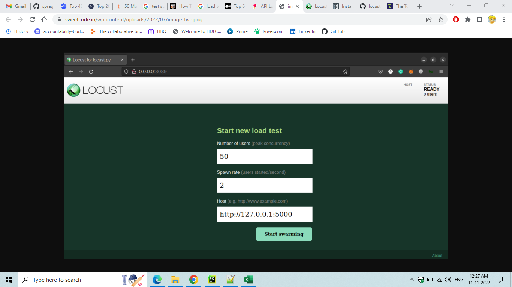
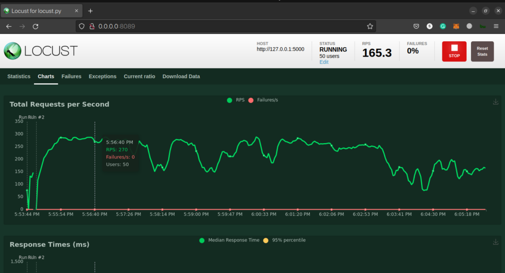
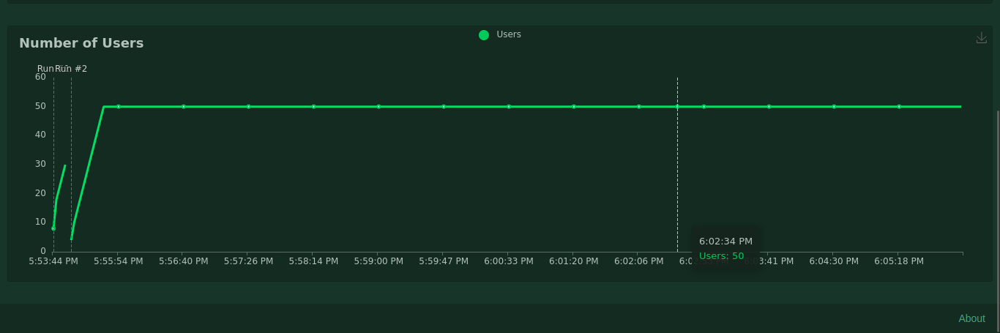

<h1 align="center">Book-Review-API-Test</h1>

<p align="center">  
This application is built to do API testing using python scripts along with the use of Pytest module as our testing framework.
</p>


## Languages, libraries and tool used

* __[Python](https://www.python.org/downloads/)__
* __[Pytest](https://docs.pytest.org/en/6.2.x/getting-started.html)__
* __[Requests](https://docs.python-requests.org/en/master/)__
* __[JsonPath](https://pypi.org/project/jsonpath/)__
* __[Pycharm](https://www.jetbrains.com/pycharm/download/)__

Above Features are used to make code simple, generic, understandable, clean and easily maintainable for future development.

## Installation

Install the dependencies and start the testing.

 __Install Pytest__:
```sh
pip install -U pytest
```
 __Install Requests__:
```sh
pip install requests
```
 __Install Json Path__:
```sh
pip install jsonpath
```
## Automated tests

__To run a test, you can simply write the following command on Terminal__:
```sh
pytest
```

__To run and get details of all the executed test, you can simply write the following command on Terminal__:
```sh
pytest -rA
```

__To run and generate full HTML details report of all the executed test, you can simply write the following commands on Terminal__:

__But first install [Pytest-HTML](https://pypi.org/project/pytest-html/) by writing the following command on Terminal__
```sh
pip install pytest-html
```
__Then write the following command on Terminal__
```sh
pytest --html==YOUR_REPORT_FILE_NAME.html
```

__To see the reports, open the generated .html file__

# Prerequisites
* __Python__
* __Any IDE__

# Built With

* __[Python](https://www.python.org/downloads/)__ - Language used to build the application.
* __[Pycharm](https://www.jetbrains.com/pycharm/download/)__ - The IDE for writing Automation Test Scripts


# Performance and Load Test:

# Our API has 2 endpoints:
The first endpoint will store the Book and Review data to DB.
The second will return the data in DB with respect to ISBN.

# To get started, we need to first install our dependencies, locust and flask. We can do this by using pip:
```sh
pip install locust flask
```
create locust.py file which will hold the code for load testing API
```
API                                 Method
BOOK-ISBN                           GET
BOOK-ISBN-TITLE-AUTHOR-REVIEW       POST
```
# performance and Load tool:
Locust trigger Test








# Load requirements:
Get Service - Users -->Maximum and Minimum users cand be logged in as given by the PO
Post Service - Users -->Maximum and Minimum users cand be logged in as given by the PO
requirements
# performance requirements:
Post Service response time -- response must be less than 500ms
Get Service response time -- response must be less than 500ms

To get all data in terminal.
```sh
locust -f locust.py --headless --users 50 --spawn-rate 2 -H http://localhost:5000
```

Challenges:
as mentioned, the current service will not support a realistic load. 


